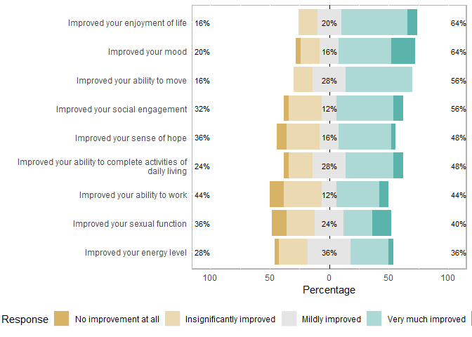

cbd tables
================
David DeStephano
March 26, 2020

| names                                                                |   statistic|    p.value|  parameter| method                     |
|:---------------------------------------------------------------------|-----------:|----------:|----------:|:---------------------------|
| race\_simple\_2                                                      |   2.4049577|  0.4927124|          3| Pearson's Chi-squared test |
| ethnicity                                                            |   0.8309347|  0.3620024|          1| Pearson's Chi-squared test |
| marital\_status                                                      |   3.4600706|  0.3259779|          3| Pearson's Chi-squared test |
| highest\_level\_of\_education                                        |   5.4601953|  0.3623304|          5| Pearson's Chi-squared test |
| insurance                                                            |   2.3441771|  0.6727380|          4| Pearson's Chi-squared test |
| employment                                                           |   1.6490426|  0.7999519|          4| Pearson's Chi-squared test |
| what\_medications\_have\_you\_used\_for\_your\_pelvic\_pain          |  34.7518074|  0.0042969|         16| Pearson's Chi-squared test |
| what\_adjuvant\_treatments\_have\_you\_used\_for\_your\_pelvic\_pain |  84.0253978|  0.0000000|         24| Pearson's Chi-squared test |
| otc\_meds                                                            |   3.1363298|  0.0765659|          1| Pearson's Chi-squared test |
| muscle\_relax\_or\_vag\_supp                                         |   4.1434665|  0.0417955|          1| Pearson's Chi-squared test |
| tpi\_or\_botox                                                       |   0.0192687|  0.8895990|          1| Pearson's Chi-squared test |
| opioids                                                              |   0.8989388|  0.3430664|          1| Pearson's Chi-squared test |
| adjuvant\_surgery                                                    |   3.9603662|  0.0465836|          1| Pearson's Chi-squared test |
| adjuvant\_pfpt                                                       |   0.6130938|  0.4336253|          1| Pearson's Chi-squared test |
| adjuvant\_yoga\_pilates                                              |   2.2095138|  0.1371619|          1| Pearson's Chi-squared test |
| adjuvant\_acupuncture                                                |   0.8525788|  0.3558238|          1| Pearson's Chi-squared test |

``` r
cbd[sapply(cbd, is.character)] <- lapply(cbd[sapply(cbd, is.character)], as.factor)

levels(cbd$have_you_used_either_cbd_or_thc_as_treatment_for_your_pelvic_pain)
```

    ## [1] "No"  "Yes"

``` r
cbd$have_you_used_either_cbd_or_thc_as_treatment_for_your_pelvic_pain <- 
  factor(cbd$have_you_used_either_cbd_or_thc_as_treatment_for_your_pelvic_pain, 
         levels=c("Yes","No"))

#label(cbd$have_you_used_either_cbd_or_thc_as_treatment_for_your_pelvic_pain) <- "Cannabis or THC"


cols<-c('otc_meds',
'muscle_relax_or_vag_supp',
'tpi_or_botox',
'opioids',
'adjuvant_surgery',
'adjuvant_pfpt',
'adjuvant_yoga_pilates',
'adjuvant_acupuncture')

cbd[,cols] <- lapply(cbd[,cols],as.factor)
```

<table class="gmisc_table" style="border-collapse: collapse; margin-top: 1em; margin-bottom: 1em;">
<thead>
<tr>
<td colspan="4" style="text-align: left;">
P-values generated from a custom set of values
</td>
</tr>
<tr>
<th style="border-bottom: 1px solid grey; border-top: 2px solid grey;">
</th>
<th style="border-bottom: 1px solid grey; border-top: 2px solid grey; text-align: center;">
Yes<br /> No. 26
</th>
<th style="border-bottom: 1px solid grey; border-top: 2px solid grey; text-align: center;">
No<br /> No. 87
</th>
<th style="border-bottom: 1px solid grey; border-top: 2px solid grey; text-align: center;">
P-value
</th>
</tr>
</thead>
<tbody>
<tr>
<td style="text-align: left;">
Age (years)
</td>
<td style="text-align: center;">
39.9 (±15.8)
</td>
<td style="text-align: center;">
45.1 (±13.7)
</td>
<td style="text-align: center;">
0.11
</td>
</tr>
<tr>
<td colspan="3" style>
Race
</td>
<td style="text-align: center;">
0.69
</td>
</tr>
<tr>
<td style="text-align: left;">
  Asian
</td>
<td style="text-align: center;">
0 (0.0%)
</td>
<td style="text-align: center;">
3 (4.2%)
</td>
<td style="text-align: center;">
</td>
</tr>
<tr>
<td style="text-align: left;">
  Black
</td>
<td style="text-align: center;">
1 (4.0%)
</td>
<td style="text-align: center;">
8 (11.3%)
</td>
<td style="text-align: center;">
</td>
</tr>
<tr>
<td style="text-align: left;">
  Other
</td>
<td style="text-align: center;">
1 (4.0%)
</td>
<td style="text-align: center;">
3 (4.2%)
</td>
<td style="text-align: center;">
</td>
</tr>
<tr>
<td style="text-align: left;">
  White
</td>
<td style="text-align: center;">
23 (92.0%)
</td>
<td style="text-align: center;">
57 (80.3%)
</td>
<td style="text-align: center;">
</td>
</tr>
<tr>
<td colspan="3" style>
Ethnicity
</td>
<td style="text-align: center;">
0.68
</td>
</tr>
<tr>
<td style="text-align: left;">
  Hispanic/Latino
</td>
<td style="text-align: center;">
1 (4.0%)
</td>
<td style="text-align: center;">
7 (9.9%)
</td>
<td style="text-align: center;">
</td>
</tr>
<tr>
<td style="text-align: left;">
  Not Hispanic/Latino
</td>
<td style="text-align: center;">
24 (96.0%)
</td>
<td style="text-align: center;">
64 (90.1%)
</td>
<td style="text-align: center;">
</td>
</tr>
<tr>
<td colspan="3" style>
Marital Status
</td>
<td style="text-align: center;">
0.43
</td>
</tr>
<tr>
<td style="text-align: left;">
  Married or commited relationship
</td>
<td style="text-align: center;">
18 (72.0%)
</td>
<td style="text-align: center;">
53 (74.6%)
</td>
<td style="text-align: center;">
</td>
</tr>
<tr>
<td style="text-align: left;">
  Never married
</td>
<td style="text-align: center;">
5 (20.0%)
</td>
<td style="text-align: center;">
12 (16.9%)
</td>
<td style="text-align: center;">
</td>
</tr>
<tr>
<td style="text-align: left;">
  Separated or divorced
</td>
<td style="text-align: center;">
1 (4.0%)
</td>
<td style="text-align: center;">
6 (8.5%)
</td>
<td style="text-align: center;">
</td>
</tr>
<tr>
<td style="text-align: left;">
  Widowed
</td>
<td style="text-align: center;">
1 (4.0%)
</td>
<td style="text-align: center;">
0 (0.0%)
</td>
<td style="text-align: center;">
</td>
</tr>
<tr>
<td colspan="3" style>
Highest level of Education
</td>
<td style="text-align: center;">
0.42
</td>
</tr>
<tr>
<td style="text-align: left;">
  Bachelors degree
</td>
<td style="text-align: center;">
11 (44.0%)
</td>
<td style="text-align: center;">
20 (28.2%)
</td>
<td style="text-align: center;">
</td>
</tr>
<tr>
<td style="text-align: left;">
  Doctoral degree or professional degree
</td>
<td style="text-align: center;">
0 (0.0%)
</td>
<td style="text-align: center;">
3 (4.2%)
</td>
<td style="text-align: center;">
</td>
</tr>
<tr>
<td style="text-align: left;">
  High school diploma or GED
</td>
<td style="text-align: center;">
1 (4.0%)
</td>
<td style="text-align: center;">
9 (12.7%)
</td>
<td style="text-align: center;">
</td>
</tr>
<tr>
<td style="text-align: left;">
  Masters degree
</td>
<td style="text-align: center;">
6 (24.0%)
</td>
<td style="text-align: center;">
11 (15.5%)
</td>
<td style="text-align: center;">
</td>
</tr>
<tr>
<td style="text-align: left;">
  Some college or Associates degree
</td>
<td style="text-align: center;">
7 (28.0%)
</td>
<td style="text-align: center;">
27 (38.0%)
</td>
<td style="text-align: center;">
</td>
</tr>
<tr>
<td style="text-align: left;">
  Some high school
</td>
<td style="text-align: center;">
0 (0.0%)
</td>
<td style="text-align: center;">
1 (1.4%)
</td>
<td style="text-align: center;">
</td>
</tr>
<tr>
<td colspan="3" style>
Insurance Payer
</td>
<td style="text-align: center;">
0.79
</td>
</tr>
<tr>
<td style="text-align: left;">
  Medicaid or Medicare
</td>
<td style="text-align: center;">
1 (4.0%)
</td>
<td style="text-align: center;">
4 (5.6%)
</td>
<td style="text-align: center;">
</td>
</tr>
<tr>
<td style="text-align: left;">
  No health insurance
</td>
<td style="text-align: center;">
0 (0.0%)
</td>
<td style="text-align: center;">
1 (1.4%)
</td>
<td style="text-align: center;">
</td>
</tr>
<tr>
<td style="text-align: left;">
  Other
</td>
<td style="text-align: center;">
2 (8.0%)
</td>
<td style="text-align: center;">
2 (2.8%)
</td>
<td style="text-align: center;">
</td>
</tr>
<tr>
<td style="text-align: left;">
  Private insurance (through work or purchased on market)
</td>
<td style="text-align: center;">
22 (88.0%)
</td>
<td style="text-align: center;">
62 (87.3%)
</td>
<td style="text-align: center;">
</td>
</tr>
<tr>
<td style="text-align: left;">
  Veterans benefits
</td>
<td style="text-align: center;">
0 (0.0%)
</td>
<td style="text-align: center;">
2 (2.8%)
</td>
<td style="text-align: center;">
</td>
</tr>
<tr>
<td colspan="3" style>
Employment status
</td>
<td style="text-align: center;">
0.75
</td>
</tr>
<tr>
<td style="text-align: left;">
  Disabled
</td>
<td style="text-align: center;">
3 (12.0%)
</td>
<td style="text-align: center;">
4 (5.6%)
</td>
<td style="text-align: center;">
</td>
</tr>
<tr>
<td style="text-align: left;">
  Otherwise unemployed
</td>
<td style="text-align: center;">
3 (12.0%)
</td>
<td style="text-align: center;">
10 (14.1%)
</td>
<td style="text-align: center;">
</td>
</tr>
<tr>
<td style="text-align: left;">
  Retired
</td>
<td style="text-align: center;">
4 (16.0%)
</td>
<td style="text-align: center;">
8 (11.3%)
</td>
<td style="text-align: center;">
</td>
</tr>
<tr>
<td style="text-align: left;">
  Student only
</td>
<td style="text-align: center;">
1 (4.0%)
</td>
<td style="text-align: center;">
3 (4.2%)
</td>
<td style="text-align: center;">
</td>
</tr>
<tr>
<td style="text-align: left;">
  Working
</td>
<td style="text-align: center;">
14 (56.0%)
</td>
<td style="text-align: center;">
46 (64.8%)
</td>
<td style="text-align: center;">
</td>
</tr>
<tr>
<td colspan="3" style>
Over the counter pain medications
</td>
<td style="text-align: center;">
0.099
</td>
</tr>
<tr>
<td style="text-align: left;">
  0
</td>
<td style="text-align: center;">
5 (19.2%)
</td>
<td style="text-align: center;">
33 (37.9%)
</td>
<td style="text-align: center;">
</td>
</tr>
<tr>
<td style="text-align: left;">
  1
</td>
<td style="text-align: center;">
21 (80.8%)
</td>
<td style="text-align: center;">
54 (62.1%)
</td>
<td style="text-align: center;">
</td>
</tr>
<tr>
<td colspan="3" style>
Muscle relaxers or vaginal suppositories
</td>
<td style="text-align: center;">
0.053
</td>
</tr>
<tr>
<td style="text-align: left;">
  0
</td>
<td style="text-align: center;">
14 (53.8%)
</td>
<td style="text-align: center;">
65 (74.7%)
</td>
<td style="text-align: center;">
</td>
</tr>
<tr>
<td style="text-align: left;">
  1
</td>
<td style="text-align: center;">
12 (46.2%)
</td>
<td style="text-align: center;">
22 (25.3%)
</td>
<td style="text-align: center;">
</td>
</tr>
<tr>
<td colspan="3" style>
Trigger point or Botox injections
</td>
<td style="text-align: center;">
1.0
</td>
</tr>
<tr>
<td style="text-align: left;">
  0
</td>
<td style="text-align: center;">
24 (92.3%)
</td>
<td style="text-align: center;">
81 (93.1%)
</td>
<td style="text-align: center;">
</td>
</tr>
<tr>
<td style="text-align: left;">
  1
</td>
<td style="text-align: center;">
2 (7.7%)
</td>
<td style="text-align: center;">
6 (6.9%)
</td>
<td style="text-align: center;">
</td>
</tr>
<tr>
<td colspan="3" style>
Opioid medications
</td>
<td style="text-align: center;">
0.41
</td>
</tr>
<tr>
<td style="text-align: left;">
  0
</td>
<td style="text-align: center;">
19 (73.1%)
</td>
<td style="text-align: center;">
71 (81.6%)
</td>
<td style="text-align: center;">
</td>
</tr>
<tr>
<td style="text-align: left;">
  1
</td>
<td style="text-align: center;">
7 (26.9%)
</td>
<td style="text-align: center;">
16 (18.4%)
</td>
<td style="text-align: center;">
</td>
</tr>
<tr>
<td colspan="3" style>
Surgery
</td>
<td style="text-align: center;">
0.075
</td>
</tr>
<tr>
<td style="text-align: left;">
  0
</td>
<td style="text-align: center;">
18 (69.2%)
</td>
<td style="text-align: center;">
75 (86.2%)
</td>
<td style="text-align: center;">
</td>
</tr>
<tr>
<td style="text-align: left;">
  1
</td>
<td style="text-align: center;">
8 (30.8%)
</td>
<td style="text-align: center;">
12 (13.8%)
</td>
<td style="text-align: center;">
</td>
</tr>
<tr>
<td colspan="3" style>
Pelvic floor physical therapy
</td>
<td style="text-align: center;">
0.62
</td>
</tr>
<tr>
<td style="text-align: left;">
  0
</td>
<td style="text-align: center;">
20 (76.9%)
</td>
<td style="text-align: center;">
60 (69.0%)
</td>
<td style="text-align: center;">
</td>
</tr>
<tr>
<td style="text-align: left;">
  1
</td>
<td style="text-align: center;">
6 (23.1%)
</td>
<td style="text-align: center;">
27 (31.0%)
</td>
<td style="text-align: center;">
</td>
</tr>
<tr>
<td colspan="3" style>
Yoga or Pilates
</td>
<td style="text-align: center;">
0.20
</td>
</tr>
<tr>
<td style="text-align: left;">
  0
</td>
<td style="text-align: center;">
20 (76.9%)
</td>
<td style="text-align: center;">
77 (88.5%)
</td>
<td style="text-align: center;">
</td>
</tr>
<tr>
<td style="text-align: left;">
  1
</td>
<td style="text-align: center;">
6 (23.1%)
</td>
<td style="text-align: center;">
10 (11.5%)
</td>
<td style="text-align: center;">
</td>
</tr>
<tr>
<td colspan="3" style>
Acupuncture
</td>
<td style="text-align: center;">
0.32
</td>
</tr>
<tr>
<td style="text-align: left;">
  0
</td>
<td style="text-align: center;">
24 (92.3%)
</td>
<td style="text-align: center;">
84 (96.6%)
</td>
<td style="text-align: center;">
</td>
</tr>
<tr>
<td style="border-bottom: 2px solid grey; text-align: left;">
  1
</td>
<td style="border-bottom: 2px solid grey; text-align: center;">
2 (7.7%)
</td>
<td style="border-bottom: 2px solid grey; text-align: center;">
3 (3.4%)
</td>
<td style="border-bottom: 2px solid grey; text-align: center;">
</td>
</tr>
</tbody>
<tfoot>
<tr>
<td colspan="4">
† Whatever you want the dagger to be
</td>
</tr>
</tfoot>
</table>
The fellow was including NA's in the proportion calculations..

Likert
------

``` r
cbd_likert <- cbd %>% select(starts_with("to_what_extent"))

cbd_likert <- data.frame(cbd_likert) %>% na.omit()


levels <- c("No improvement at all", "Insignificantly improved", "Mildly improved", "Very much improved", "Significantly Improved / Complete Recovery")


cbd_likert<-cbd_likert %>% 
  mutate_at(.vars = vars(dplyr::matches("to_what_extent")),
                     .funs = funs(factor(., levels = levels, 
                                             ordered = TRUE)))
```

    ## Warning: funs() is soft deprecated as of dplyr 0.8.0
    ## Please use a list of either functions or lambdas: 
    ## 
    ##   # Simple named list: 
    ##   list(mean = mean, median = median)
    ## 
    ##   # Auto named with `tibble::lst()`: 
    ##   tibble::lst(mean, median)
    ## 
    ##   # Using lambdas
    ##   list(~ mean(., trim = .2), ~ median(., na.rm = TRUE))
    ## This warning is displayed once per session.

``` r
names(cbd_likert) <- sub("to_what_extent_has_cannabis_", "", names(cbd_likert))

names(cbd_likert) <- sub("_cooking_cleaning_bathing", "", names(cbd_likert))

names(cbd_likert) <- sub("_visiting_with_friends_and_family", "", names(cbd_likert))

names(cbd_likert) <- sub("_", " ", names(cbd_likert))
names(cbd_likert) <- sub("_", " ", names(cbd_likert))
names(cbd_likert) <- sub("_", " ", names(cbd_likert))
names(cbd_likert) <- sub("_", " ", names(cbd_likert))
names(cbd_likert) <- sub("_", " ", names(cbd_likert))
names(cbd_likert) <- sub("_", " ", names(cbd_likert))
names(cbd_likert) <- sub("_", " ", names(cbd_likert))
names(cbd_likert) <- sub("_", " ", names(cbd_likert))
names(cbd_likert) <- sub("_", " ", names(cbd_likert))
names(cbd_likert) <- sub("_", " ", names(cbd_likert))

names(cbd_likert) <- sub("improved", "Improved", names(cbd_likert))


names(cbd_likert)
```

    ## [1] "Improved your ability to move"                               
    ## [2] "Improved your ability to complete activities of daily living"
    ## [3] "Improved your energy level"                                  
    ## [4] "Improved your mood"                                          
    ## [5] "Improved your enjoyment of life"                             
    ## [6] "Improved your social engagement"                             
    ## [7] "Improved your ability to work"                               
    ## [8] "Improved your sense of hope"                                 
    ## [9] "Improved your sexual function"

``` r
# library(labelled)
# var_label(cbd_likert) <- c("Ability to Move", "sepal width", "petal length", "petal width", "5",
#                            "6","7","8","9")


result=likert(cbd_likert)
dfSummary(cbd_likert)
```

    ## Data Frame Summary  
    ## cbd_likert  
    ## Dimensions: 25 x 9  
    ## Duplicates: 0  
    ## 
    ## ---------------------------------------------------------------------------------------------------------------------------------
    ## No   Variable                            Stats / Values                  Freqs (% of Valid)   Graph            Valid    Missing  
    ## ---- ----------------------------------- ------------------------------- -------------------- ---------------- -------- ---------
    ## 1    Improved your ability to move       1. No improvement at all         0 ( 0.0%)                            25       0        
    ##      [ordered, factor]                   2. Insignificantly improved      4 (16.0%)           III              (100%)   (0%)     
    ##                                          3. Mildly improved               7 (28.0%)           IIIII                              
    ##                                          4. Very much improved           14 (56.0%)           IIIIIIIIIII                        
    ##                                          5. Significantly Improved /      0 ( 0.0%)                                              
    ## 
    ## 2    Improved your ability to complete   1. No improvement at all         1 ( 4.0%)                            25       0        
    ##      activities of daily living          2. Insignificantly improved      5 (20.0%)           IIII             (100%)   (0%)     
    ##      [ordered, factor]                   3. Mildly improved               7 (28.0%)           IIIII                              
    ##                                          4. Very much improved           10 (40.0%)           IIIIIIII                           
    ##                                          5. Significantly Improved /      2 ( 8.0%)           I                                  
    ## 
    ## 3    Improved your energy level          1. No improvement at all        1 ( 4.0%)                             25       0        
    ##      [ordered, factor]                   2. Insignificantly improved     6 (24.0%)            IIII             (100%)   (0%)     
    ##                                          3. Mildly improved              9 (36.0%)            IIIIIII                            
    ##                                          4. Very much improved           8 (32.0%)            IIIIII                             
    ##                                          5. Significantly Improved /     1 ( 4.0%)                                               
    ## 
    ## 4    Improved your mood                  1. No improvement at all         1 ( 4.0%)                            25       0        
    ##      [ordered, factor]                   2. Insignificantly improved      4 (16.0%)           III              (100%)   (0%)     
    ##                                          3. Mildly improved               4 (16.0%)           III                                
    ##                                          4. Very much improved           11 (44.0%)           IIIIIIII                           
    ##                                          5. Significantly Improved /      5 (20.0%)           IIII                               
    ## 
    ## 5    Improved your enjoyment of life     1. No improvement at all         0 ( 0.0%)                            25       0        
    ##      [ordered, factor]                   2. Insignificantly improved      4 (16.0%)           III              (100%)   (0%)     
    ##                                          3. Mildly improved               5 (20.0%)           IIII                               
    ##                                          4. Very much improved           14 (56.0%)           IIIIIIIIIII                        
    ##                                          5. Significantly Improved /      2 ( 8.0%)           I                                  
    ## 
    ## 6    Improved your social engagement     1. No improvement at all         1 ( 4.0%)                            25       0        
    ##      [ordered, factor]                   2. Insignificantly improved      7 (28.0%)           IIIII            (100%)   (0%)     
    ##                                          3. Mildly improved               3 (12.0%)           II                                 
    ##                                          4. Very much improved           12 (48.0%)           IIIIIIIII                          
    ##                                          5. Significantly Improved /      2 ( 8.0%)           I                                  
    ## 
    ## 7    Improved your ability to work       1. No improvement at all        3 (12.0%)            II               25       0        
    ##      [ordered, factor]                   2. Insignificantly improved     8 (32.0%)            IIIIII           (100%)   (0%)     
    ##                                          3. Mildly improved              3 (12.0%)            II                                 
    ##                                          4. Very much improved           9 (36.0%)            IIIIIII                            
    ##                                          5. Significantly Improved /     2 ( 8.0%)            I                                  
    ## 
    ## 8    Improved your sense of hope         1. No improvement at all         2 ( 8.0%)           I                25       0        
    ##      [ordered, factor]                   2. Insignificantly improved      7 (28.0%)           IIIII            (100%)   (0%)     
    ##                                          3. Mildly improved               4 (16.0%)           III                                
    ##                                          4. Very much improved           11 (44.0%)           IIIIIIII                           
    ##                                          5. Significantly Improved /      1 ( 4.0%)                                              
    ## 
    ## 9    Improved your sexual function       1. No improvement at all        3 (12.0%)            II               25       0        
    ##      [ordered, factor]                   2. Insignificantly improved     6 (24.0%)            IIII             (100%)   (0%)     
    ##                                          3. Mildly improved              6 (24.0%)            IIII                               
    ##                                          4. Very much improved           6 (24.0%)            IIII                               
    ##                                          5. Significantly Improved /     4 (16.0%)            III                                
    ## ---------------------------------------------------------------------------------------------------------------------------------

``` r
plot(result, type="bar")
```



``` r
library(expss)
```

    ## Warning: package 'expss' was built under R version 3.6.3

    ## Registered S3 methods overwritten by 'expss':
    ##   method                 from 
    ##   [.labelled             Hmisc
    ##   as.data.frame.labelled base 
    ##   print.labelled         Hmisc

    ## 
    ## Attaching package: 'expss'

    ## The following object is masked from 'package:likert':
    ## 
    ##     recode

    ## The following objects are masked from 'package:magrittr':
    ## 
    ##     and, equals, or

    ## The following objects are masked from 'package:stringr':
    ## 
    ##     fixed, regex

    ## The following objects are masked from 'package:dplyr':
    ## 
    ##     between, compute, contains, first, last, na_if, recode, vars

    ## The following objects are masked from 'package:purrr':
    ## 
    ##     keep, modify, modify_if, transpose, when

    ## The following objects are masked from 'package:tidyr':
    ## 
    ##     contains, nest

    ## The following object is masked from 'package:ggplot2':
    ## 
    ##     vars

``` r
# add value lables for preserving empty categories
#val_lab(cbd_likert) = autonum(1:5)
res = cbd_likert
for(each in colnames(cbd_likert)){
    res = res %>% 
        tab_cells(list(each)) %>% 
        tab_cols(vars(each)) %>% 
        tab_stat_rpct(total_row_position = "none")
}


res = res %>% tab_pivot() 
# add percentage sign
recode(res[,-1]) = other ~ function(x) ifelse(is.na(x), NA, paste0(round(x, 0), "%"))
res
```

<table class="gmisc_table" style="border-collapse: collapse; margin-top: 1em; margin-bottom: 1em;">
<thead>
<tr>
<th style="font-weight: 900; border-bottom: 1px solid grey; border-top: 2px solid grey; text-align: center;">
</th>
<th style="border-bottom: 1px solid grey; border-top: 2px solid grey; text-align: center;">
 No improvement at all 
</th>
<th style="border-bottom: 1px solid grey; border-top: 2px solid grey; text-align: center;">
 Insignificantly improved 
</th>
<th style="border-bottom: 1px solid grey; border-top: 2px solid grey; text-align: center;">
 Mildly improved 
</th>
<th style="border-bottom: 1px solid grey; border-top: 2px solid grey; text-align: center;">
 Very much improved 
</th>
<th style="border-bottom: 1px solid grey; border-top: 2px solid grey; text-align: center;">
 Significantly Improved / Complete Recovery 
</th>
</tr>
</thead>
<tbody>
<tr>
<td style="text-align: left;">
 Improved your ability to move 
</td>
<td style="text-align: right;">
</td>
<td style="text-align: right;">
16%
</td>
<td style="text-align: right;">
28%
</td>
<td style="text-align: right;">
56%
</td>
<td style="text-align: right;">
</td>
</tr>
<tr>
<td style="text-align: left;">
 Improved your ability to complete activities of daily living 
</td>
<td style="text-align: right;">
4%
</td>
<td style="text-align: right;">
20%
</td>
<td style="text-align: right;">
28%
</td>
<td style="text-align: right;">
40%
</td>
<td style="text-align: right;">
8%
</td>
</tr>
<tr>
<td style="text-align: left;">
 Improved your energy level 
</td>
<td style="text-align: right;">
4%
</td>
<td style="text-align: right;">
24%
</td>
<td style="text-align: right;">
36%
</td>
<td style="text-align: right;">
32%
</td>
<td style="text-align: right;">
4%
</td>
</tr>
<tr>
<td style="text-align: left;">
 Improved your mood 
</td>
<td style="text-align: right;">
4%
</td>
<td style="text-align: right;">
16%
</td>
<td style="text-align: right;">
16%
</td>
<td style="text-align: right;">
44%
</td>
<td style="text-align: right;">
20%
</td>
</tr>
<tr>
<td style="text-align: left;">
 Improved your enjoyment of life 
</td>
<td style="text-align: right;">
</td>
<td style="text-align: right;">
16%
</td>
<td style="text-align: right;">
20%
</td>
<td style="text-align: right;">
56%
</td>
<td style="text-align: right;">
8%
</td>
</tr>
<tr>
<td style="text-align: left;">
 Improved your social engagement 
</td>
<td style="text-align: right;">
4%
</td>
<td style="text-align: right;">
28%
</td>
<td style="text-align: right;">
12%
</td>
<td style="text-align: right;">
48%
</td>
<td style="text-align: right;">
8%
</td>
</tr>
<tr>
<td style="text-align: left;">
 Improved your ability to work 
</td>
<td style="text-align: right;">
12%
</td>
<td style="text-align: right;">
32%
</td>
<td style="text-align: right;">
12%
</td>
<td style="text-align: right;">
36%
</td>
<td style="text-align: right;">
8%
</td>
</tr>
<tr>
<td style="text-align: left;">
 Improved your sense of hope 
</td>
<td style="text-align: right;">
8%
</td>
<td style="text-align: right;">
28%
</td>
<td style="text-align: right;">
16%
</td>
<td style="text-align: right;">
44%
</td>
<td style="text-align: right;">
4%
</td>
</tr>
<tr>
<td style="border-bottom: 2px solid grey; text-align: left;">
 Improved your sexual function 
</td>
<td style="border-bottom: 2px solid grey; text-align: right;">
12%
</td>
<td style="border-bottom: 2px solid grey; text-align: right;">
24%
</td>
<td style="border-bottom: 2px solid grey; text-align: right;">
24%
</td>
<td style="border-bottom: 2px solid grey; text-align: right;">
24%
</td>
<td style="border-bottom: 2px solid grey; text-align: right;">
16%
</td>
</tr>
</tbody>
</table>
``` r
library(knitr)
res %>% kable(caption = "To what extent has cannabis improved the following aspects? (n=25)")
```

| row\_labels                                                  | No improvement at all | Insignificantly improved | Mildly improved | Very much improved | Significantly Improved / Complete Recovery |
|:-------------------------------------------------------------|:----------------------|:-------------------------|:----------------|:-------------------|:-------------------------------------------|
| Improved your ability to move                                | NA                    | 16%                      | 28%             | 56%                | NA                                         |
| Improved your ability to complete activities of daily living | 4%                    | 20%                      | 28%             | 40%                | 8%                                         |
| Improved your energy level                                   | 4%                    | 24%                      | 36%             | 32%                | 4%                                         |
| Improved your mood                                           | 4%                    | 16%                      | 16%             | 44%                | 20%                                        |
| Improved your enjoyment of life                              | NA                    | 16%                      | 20%             | 56%                | 8%                                         |
| Improved your social engagement                              | 4%                    | 28%                      | 12%             | 48%                | 8%                                         |
| Improved your ability to work                                | 12%                   | 32%                      | 12%             | 36%                | 8%                                         |
| Improved your sense of hope                                  | 8%                    | 28%                      | 16%             | 44%                | 4%                                         |
| Improved your sexual function                                | 12%                   | 24%                      | 24%             | 24%                | 16%                                        |

Table 3
=======

``` r
df <- cbd%>%filter(what_component_of_medical_cannabis_have_you_used!="Unsure") %>%  
  select(what_component_of_medical_cannabis_have_you_used, how_often_do_you_use_medical_cannabis, topical, inhaled, ingestion, improved_pain_cramping_spasms,improved_irrit_depr_and_anxiety, improved_sleeplessness_insomnia, improved_libido, improved_appetite_weight_loss, side_effects_nausea_abd_pain_constipation_diarrhea_dry_mouth,side_effects_confusion_lightheadedness_paranoida_memory_issues_sleepiness_hallucinations, side_effects_feeling_high, side_effects_none) %>%
  na.omit()

  

write.csv(df,"File_Name.csv", row.names = FALSE)

#Did in SAS
```
